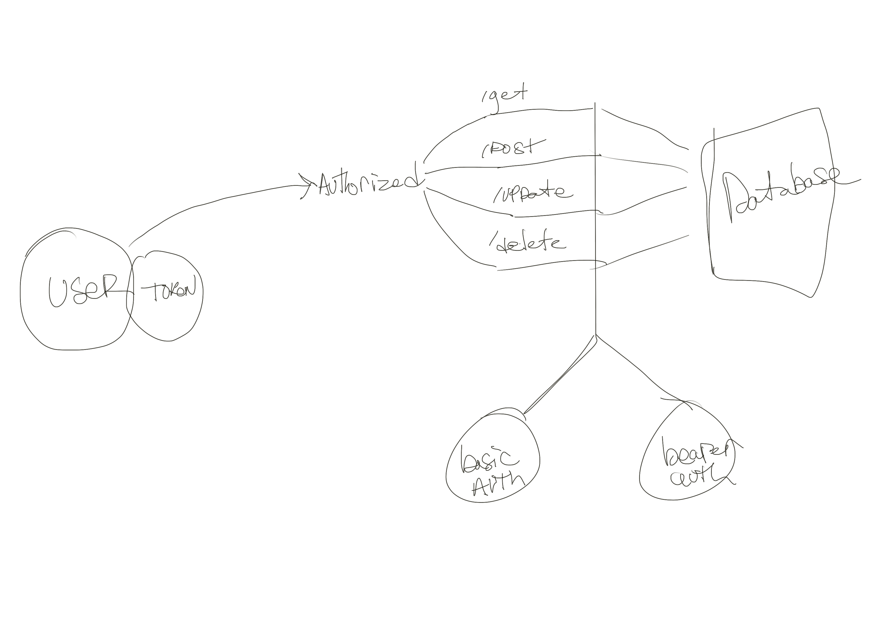

# auth-api
Authentication Server Phase 3: Role Based Access Control

## Author - Tek Jones
---

## Deployment - https://tek-jones-auth-api.herokuapp.com/
--- 

## test
- npm run test

## start
- node .

## UML - 

## Routes
/ signup
- req, res, next
- JSON response: {"username":"value", "password":"value"}

/ signin
- req, res, next
- JSON response: none
- Authentication: basic (username and password)

/users
- bearer auth, admin user role for all authorizations 

/secrets
- writer, editor or admin user role to be authorized 

/api/v2/clothes

/api/v2/food

## Contributors 
Cullen Sharp , Tim Taegorov

